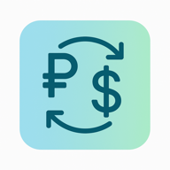

# 🇨🇺 Tasa de Cambio Cuba

<div align="center">



**Consulta las tasas de cambio del mercado informal cubano en tiempo real**

[](https://github.com/ragnarok22/tasa-cambio-proxy/actions/workflows/ci.yml)
[](https://vercel.com/new/clone?repository-url=https://github.com/ragnarok22/tasa-cambio-proxy)
[](https://opensource.org/licenses/MIT)

[Demo en vivo](https://tasa-cambio-cuba.vercel.app) · [Reportar Bug](https://github.com/ragnarok22/tasa-cambio-proxy/issues) · [Solicitar Feature](https://github.com/ragnarok22/tasa-cambio-proxy/issues)

</div>

---

## 📋 Tabla de Contenidos

- [Acerca del Proyecto](#-acerca-del-proyecto)
- [Características](#-características)
- [Tecnologías](#-tecnologías)
- [Comenzar](#-comenzar)
- [API](#-api)
- [Deployment](#-deployment)
- [Contribuir](#-contribuir)
- [Licencia](#-licencia)

---

## 🎯 Acerca del Proyecto

Una aplicación web moderna construida con Next.js que muestra las tasas de cambio actualizadas del mercado informal cubano (TRMI - Tasa Representativa del Mercado Informal). Los datos provienen directamente de la API de El Toque, actualizándose cada hora.

> **⚠️ Disclaimer:** Las tasas mostradas son **referenciales** y pueden no reflejar el valor exacto en operaciones reales. Use esta información solo como referencia.

## ✨ Características

- 🇨🇺 **Tasas en tiempo real** para USD, EUR y MLC al Peso Cubano (CUP)
- 📊 **Interfaz limpia y moderna** con cards responsive
- ⚡ **Alto rendimiento** con SSR y cache de 1 hora
- 🎨 **Diseño atractivo** con Tailwind CSS y gradientes
- 📱 **PWA Ready** - Instálala en tu dispositivo móvil
- 🗺️ **Mapa provincial** con tasas estimadas por provincia
- 🤖 **AI Vision** para extraer tasas provinciales desde imagen
- 🌐 **SEO optimizado** con Open Graph y Twitter Cards
- ♿ **Accesible** siguiendo mejores prácticas web
- 🚀 **Edge Runtime** para generación rápida de imágenes OG

## 🛠 Tecnologías

Este proyecto está construido con tecnologías modernas y eficientes:

| Tecnología                                   | Propósito                                  |
| -------------------------------------------- | ------------------------------------------ |
| [Next.js 16](https://nextjs.org)             | Framework React con App Router y Turbopack |
| [React 19](https://react.dev)                | Biblioteca UI con Server Components        |
| [TypeScript](https://www.typescriptlang.org) | Type safety en todo el proyecto            |
| [Tailwind CSS 4](https://tailwindcss.com)    | Estilos utility-first                      |
| [OpenAI API](https://platform.openai.com)    | Extracción de tasas provinciales           |
| [Vercel](https://vercel.com)                 | Hosting y deployment                       |
| [El Toque API](https://eltoque.com)          | Fuente de datos TRMI                       |

## 🚀 Comenzar

### Prerequisitos

- **Node.js** 18.18+ o 20+
- **pnpm** 10.24.0+ (recomendado)
- **Token de El Toque API** (necesario para datos reales)
- **OpenAI API Key** (para tasas provinciales)

### Instalación Local

1. **Clona el repositorio**

```bash
git clone https://github.com/ragnarok22/tasa-cambio-proxy.git
cd tasa-cambio-proxy
```

2. **Instala dependencias**

```bash
pnpm install
```

3. **Configura variables de entorno**

```bash
cp .env.example .env.local
```

Edita `.env.local` y agrega tus credenciales:

```env
EL_TOQUE_API_TOKEN=tu_token_aqui
OPENAI_API_KEY=tu_openai_api_key_aqui
```

> **Nota:** Sin el token de El Toque la app no podrá cargar tasas reales. Sin OpenAI API Key, el mapa provincial mostrará datos vacíos.

4. **Inicia el servidor de desarrollo**

```bash
pnpm dev
```

5. **Abre tu navegador**

Visita [http://localhost:3000](http://localhost:3000) para ver la aplicación.

### 📜 Scripts Disponibles

| Comando             | Descripción                                 |
| ------------------- | ------------------------------------------- |
| `pnpm dev`          | Inicia servidor de desarrollo con Turbopack |
| `pnpm build`        | Construye la aplicación para producción     |
| `pnpm start`        | Inicia servidor de producción               |
| `pnpm lint`         | Ejecuta ESLint                              |
| `pnpm format`       | Formatea código con Prettier                |
| `pnpm format:check` | Verifica formato del código                 |

### ✅ Health Check

```bash
curl http://localhost:3000/api/exchange-rate
```

## 🔌 API

La aplicación expone endpoints para integración con otros servicios.

### `GET /api/exchange-rate`

Obtiene las tasas de cambio actuales desde El Toque API.

**Query Parameters:**

| Parámetro   | Tipo   | Requerido | Descripción                                                              |
| ----------- | ------ | --------- | ------------------------------------------------------------------------ |
| `date_from` | string | No        | Fecha inicial (YYYY-MM-DD)                                               |
| `date_to`   | string | No        | Fecha final (YYYY-MM-DD) - Diferencia máxima: 24 horas desde `date_from` |

> **⚠️ Importante:** La diferencia entre `date_from` y `date_to` debe ser menor a 24 horas.

**Respuesta exitosa (200):**

```json
{
  "usd": 442.0,
  "eur": 500.0,
  "mlc": 210.0,
  "date": "2025-10-04",
  "time": "10:34:15",
  "raw": {
    "tasas": {
      "USD": 442.0,
      "ECU": 500.0,
      "MLC": 210.0,
      "USDT_TRC20": 495.0,
      "BTC": 470.0,
      "BNB": 360.0,
      "TRX": 165.0
    },
    "date": "2025-10-04",
    "hour": 10,
    "minutes": 34,
    "seconds": 15
  }
}
```

> **Nota:** `raw` incluye el resto de las monedas y metadatos devueltos por la API.

**Respuestas de error:**

```json
// 400 - Rango de fechas inválido
{
  "error": "Date range must be less than 24 hours. The difference between date_from and date_to cannot exceed 24 hours."
}

// 400 - Fechas en orden incorrecto
{
  "error": "date_from must be before date_to"
}

// 500 - Token no configurado
{
  "error": "EL_TOQUE_API_TOKEN is not configured"
}
```

### Server Action: `fetchProvinceRates`

Obtiene tasas provinciales usando visión por computadora sobre una imagen local (`public/tasa.jpg`).

```typescript
import { fetchProvinceRates } from '@/app/actions';

const provinces = await fetchProvinceRates(442);
```

> **Nota:** Requiere `OPENAI_API_KEY` y se cachea por 12 horas para reducir costos.

### Server Action: `fetchTRMI`

También puedes usar el server action directamente en componentes:

```typescript
import { fetchTRMI } from '@/app/actions';

// Ejemplo válido: menos de 24 horas de diferencia
const result = await fetchTRMI({
  dateFrom: '2025-10-04',
  dateTo: '2025-10-04', // Mismo día
});

if (result.success) {
  console.log(result.data);
} else {
  console.error(result.error);
}
```

## 📁 Estructura del Proyecto

```
tasa-cambio-proxy/
├── src/
│   ├── components/              # UI components (cards, mapa SVG)
│   ├── data/                    # Datos estáticos
│   ├── types/                   # Tipos compartidos
│   └── app/
│       ├── api/
│       │   └── exchange-rate/
│       │       └── route.ts       # API route handler
│       ├── actions.ts             # Server actions
│       ├── page.tsx               # Página principal con cards
│       ├── layout.tsx             # Layout raíz con metadata
│       ├── manifest.ts            # PWA manifest
│       ├── sitemap.ts             # Sitemap dinámico
│       ├── icon.tsx               # Favicon dinámico
│       ├── opengraph-image.tsx    # Imagen OG dinámica
│       └── globals.css            # Estilos globales
├── public/
│   ├── favicon-*.png              # Favicons
│   ├── icon-*.png                 # Íconos PWA
│   ├── tasa.jpg                   # Imagen base para tasas provinciales
│   ├── apple-touch-icon.png       # Ícono iOS
│   └── robots.txt                 # Robots.txt
├── .github/
│   ├── ISSUE_TEMPLATE/            # Templates de issues
│   └── pull_request_template.md   # Template de PR
├── CONTRIBUTING.md                # Guía de contribución
├── SECURITY.md                    # Política de seguridad
└── CLAUDE.md                      # Guía para Claude Code
```

## 🚀 Deployment

### Desplegar en Vercel (Recomendado)

La forma más rápida de desplegar es con Vercel:

[](https://vercel.com/new/clone?repository-url=https://github.com/ragnarok22/tasa-cambio-proxy)

**Pasos:**

1. Haz clic en el botón "Deploy with Vercel"
2. Conecta tu cuenta de GitHub
3. Configura la variable de entorno `EL_TOQUE_API_TOKEN`
4. ¡Haz clic en Deploy!

### Desplegar en Otras Plataformas

Esta es una aplicación Next.js estándar compatible con cualquier plataforma que soporte Node.js:

**Netlify, Railway, Render, etc:**

```bash
# 1. Construir la aplicación
pnpm build

# 2. Iniciar servidor de producción
pnpm start
```

**Variables de entorno:**

- `EL_TOQUE_API_TOKEN` - Tu token de la API de El Toque (requerida)
- `OPENAI_API_KEY` - API key de OpenAI (opcional, para tasas provinciales)

## 🤝 Contribuir

¡Las contribuciones son bienvenidas! Este proyecto sigue un modelo de **rolling release** - todos los cambios van directo a `main`.

### Guía Rápida

1. **Fork** el repositorio
2. **Crea** una rama (`git checkout -b feature/nueva-funcionalidad`)
3. **Realiza** tus cambios
4. **Formatea** el código (`pnpm format`)
5. **Verifica** con lint (`pnpm lint`)
6. **Commit** tus cambios (`git commit -m 'feat: nueva funcionalidad'`)
7. **Push** a tu rama (`git push origin feature/nueva-funcionalidad`)
8. **Abre** un Pull Request

### 📖 Documentación para Contribuidores

- [Guía de Contribución](CONTRIBUTING.md) - Proceso detallado y estándares de código
- [Política de Seguridad](SECURITY.md) - Cómo reportar vulnerabilidades
- [CLAUDE.md](CLAUDE.md) - Guía de arquitectura del proyecto

### 💡 Ideas para Contribuir

- 📊 Gráficos de historial de tasas
- 🧮 Calculadora de conversión de monedas
- 🌍 Soporte multiidioma (ES/EN)
- 🌙 Modo oscuro
- 📱 Notificaciones de cambios de tasa
- 📈 Estadísticas y tendencias

## 🔒 Seguridad

Reporta vulnerabilidades de seguridad de forma responsable:

- 🔐 [Reportar vulnerabilidad](https://github.com/ragnarok22/tasa-cambio-proxy/security/advisories/new)
- 📄 Lee nuestra [Política de Seguridad](SECURITY.md)

## 📄 Licencia

Este proyecto está bajo la Licencia MIT. Ver el archivo [LICENSE](LICENSE) para más detalles.

## 🙏 Agradecimientos

- **Datos de tasas** proporcionados por [El Toque](https://eltoque.com)
- **Framework** construido con [Next.js](https://nextjs.org)
- **Estilos** diseñados con [Tailwind CSS](https://tailwindcss.com)
- **Fuentes** [Geist](https://vercel.com/font) de Vercel
- **Deployment** en [Vercel](https://vercel.com)

## 👨‍💻 Autor

**Reinier Hernández**

- Website: [reinierhernandez.com](https://reinierhernandez.com)
- GitHub: [@ragnarok22](https://github.com/ragnarok22)
- Twitter: [@ragnarokreinier](https://twitter.com/ragnarokreinier)

---

<div align="center">

**⭐ Si este proyecto te resulta útil, considera darle una estrella en GitHub**

Made with ❤️ in Cuba

</div>
